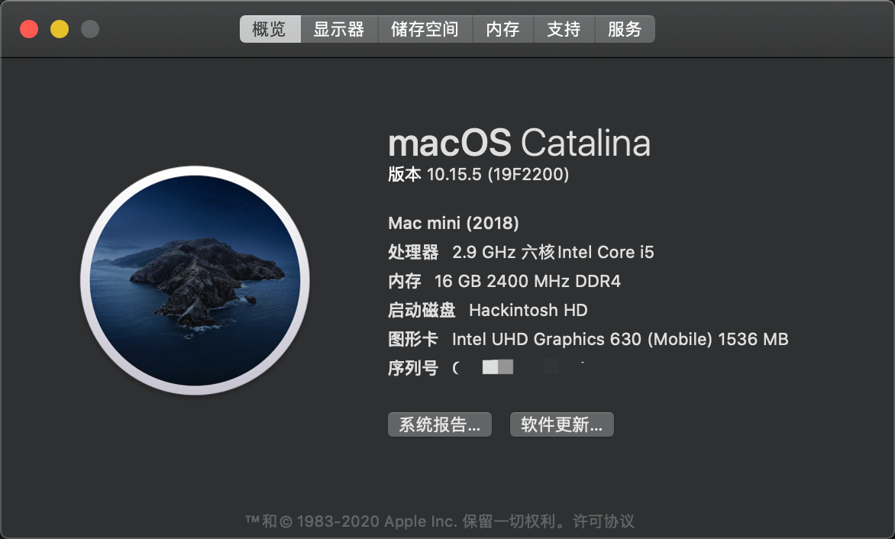
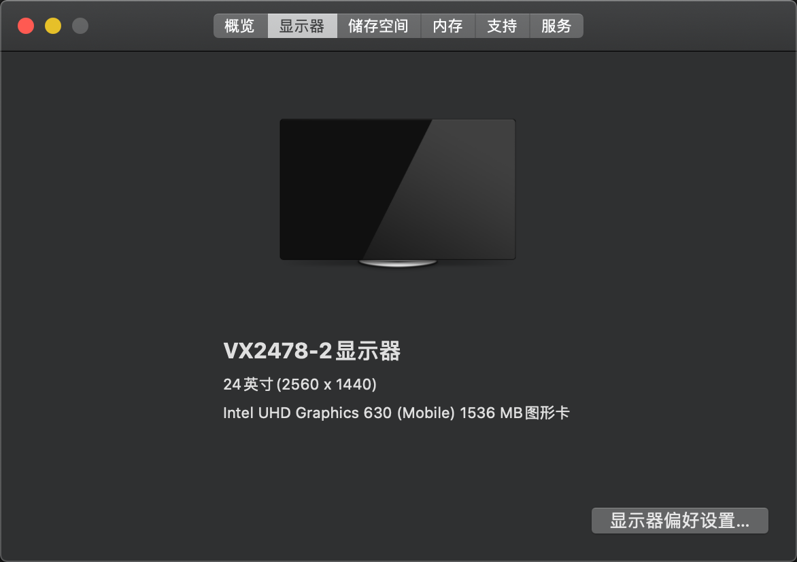

## 配置清单

主板: 微星 H310M-S03 (MS-7C18)

CPU: Intel(R) Core(TM) i5-9400

显卡: Intel(R) UHD Graphics 630

声卡: Realtek High Definition Audio

显示器: 飞利浦 2K

## 硬件驱动情况





MacOS 10.15.5 (19F2200)

核显正常，声卡正常，无独显，无蓝牙，无 WIFI

1 HDMI 1 VGA 无 DP

!!!注意: 该主板只有 1 HDMI 1 VGA，MacOS 无法使用 VGA，相当于只有一个 HDMI 接口，理论上带有 DP 接口的主板 UHD630 可以免驱驱动，可惜没有，烦

### BUG 情况

- HDMI 外接显示器熄屏后需要关闭显示器电源再打开才能亮屏

## 使用指南

参考[黑果小兵](https://blog.daliansky.net/)博客教程安装对应版本系统后，使用本仓库 EFI 覆盖原本 EFI。

### 绿屏（紫屏解决）

启动后可能会出现显卡正常驱动（显存正常）但是屏幕颜色不正常可以，以下两个方法二选一：

1. 使用 [one-key-hidpi](https://github.com/xzhih/one-key-hidpi) 脚本

    注意选择开启 【HIDPI（同时注入 EDID）】这个选项，该方法可以在 2K 屏上开启 HIDPI 的同时修复显示异常的问题。

2. 使用 `patch-edid.rb`，适用于不需要开启 HIDPI 的同学
    
    ```Bash
    # 执行此脚本后会在当前目录生成补丁文件，如我的就是 DisplayVendorID-5a63 和  DisplayVendorID-610 两个文件夹
    ruby patch-edid.rb
    # 获取可写权限
    sudo mount -uw /
    # 将补丁拷贝至 /System/Library/Displays/Contents/Resources/
    # !!! 注意将文件夹替换为自己生成的补丁，如果原来已经存在同名文件夹注意备份原文件夹
    sudo cp -r DisplayVendorID-5a63 /System/Library/Displays/Contents/Resources/Overrides
    sudo cp -r DisplayVendorID-610 /System/Library/Displays/Contents/Resources/Overrides
    ```

## update

稳定运行 11 天


